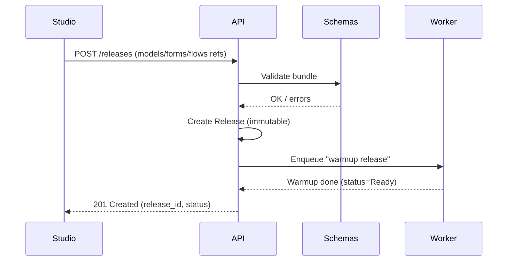

# AurenWorks — Architecture

> Apache-2.0 licensed citizen-developer platform with the Auren dragon spirit 🐉

## 1. Purpose & MVP Scope
AurenWorks enables non-engineers to build and run simple apps and automations safely:
- **Studio**: visual builder for data models, forms, and flows.
- **API (control plane)**: stores definitions, validates via schemas, exposes CRUD + publish.
- **Worker (data plane)**: executes jobs/flows triggered by events or schedules.
- **Portal**: runtime UI for end-users to use published apps.
- **Schemas**: single source of truth for contracts (JSON Schema, OpenAPI, events).
- **Infra**: repeatable environments (dev/stage/prod), CI/CD, observability.
- **Docs**: guides, tutorial, API reference.

### Non-Goals (MVP)
- Not a drag-everything enterprise suite; prioritize **forms + simple flows**.
- No multi-cloud abstraction beyond what Infra provides.
- No custom code hosting (scripts/plugins) in MVP; focus on declarative flows.

---

## 2. High-Level System

```mermaid
flowchart LR
  subgraph Studio[Studio (Builder)]
    A1[Model Designer]
    A2[Form/Flow Designer]
  end

  subgraph API[Control Plane API]
    B1[Auth/RBAC]
    B2[Projects/Models/Flows]
    B3[Publishing]
  end

  subgraph Schemas[Contracts]
    C1[JSON Schema]
    C2[OpenAPI]
    C3[Event Schemas]
  end

  subgraph Worker[Workers/Data Plane]
    D1[Queue Consumer]
    D2[Task Runners]
  end

  subgraph Portal[Runtime / End-User]
    E1[Auth UI]
    E2[App Screens]
  end

  Studio -->|CRUD via OpenAPI/GraphQL| API
  API -->|Validates| Schemas
  API -->|Enqueue jobs| Worker
  Portal -->|Read/Write data| API
  Worker -->|Emit events| API
```
---

## 3. Repositories → Components Map
- `aurenworks-studio` — Next.js/React front-end (builder).
- `aurenworks-portal` — Next.js/React front-end (runtime).
- `aurenworks-api` — Control-plane API (REST/GraphQL).
- `aurenworks-worker` — Job/flow runner + schedulers.
- `aurenworks-schemas` — JSON Schema, OpenAPI, event contracts; codegen.
- `aurenworks-infra` — Terraform/Pulumi, K8s/Helm, pipelines.
- `aurenworks-docs` — Docusaurus/Next.js docs.
- `aurenworks` — Meta docs, RFCs, governance.

---

## 4. Domain Model (MVP)
- **User**: id, email, roles.
- **Workspace/Project**: tenancy boundary.
- **Model**: typed schema (fields, relationships, validations).
- **Form/View**: UI metadata bound to a Model.
- **Flow**: steps (trigger → actions), simple branching.
- **Release**: immutable snapshot of models/forms/flows for runtime.
- **Job/Run**: execution record of a Flow with logs/status.

**IDs**: ULIDs.  
**Tenancy**: workspace_id on all records; API enforces RBAC.

---

## 5. Contracts (Schemas)
Centralize structure in `aurenworks-schemas`:
- **JSON Schema** for Model/Form/Flow.
- **OpenAPI** for REST; used by Studio clients and external devs.
- **Event Schemas** for worker I/O (CloudEvents-style).

CI in `aurenworks-schemas`:
- Validate schemas.
- Generate clients (Typescript SDK for Studio/Portal; Go/TS for services).
- Diff breaking changes (semver gate).

---

## 6. API (Control Plane)
- Endpoints: `/auth/*`, `/projects`, `/models`, `/forms`, `/flows`, `/releases`, `/jobs`.
- **Publish**: creates a Release; queues worker warm-up if needed.
- **RBAC**: Owner, Builder, Viewer (expand later).
- **Auth**: JWT/OIDC; short-lived tokens; refresh via OIDC provider (MVP: email/password or GitHub).

**Example publish flow**


---

## 7. Worker (Data Plane)
- **Queues**: pluggable (MVP: Redis or SQS).  
- **Tasks**: HTTP call, transform (JS sandbox later), conditional, delay, emit-event.  
- **Executions**: idempotent, retry policy, dead letter.  
- **Observability**: per-run logs, metrics (duration, success rate).

---

## 8. Portal (Runtime)
- Authenticated end-user UI.
- Fetches **Release** config; renders forms/views.
- Submits data → API; triggers flows (e.g., “on submit”).
- Simple theming; audit trail.

---

## 9. Data & Storage
- **Primary DB**: Postgres (multi-tenant via workspace_id + RLS later).
- **Object Storage**: assets for forms.
- **Cache**: Redis for sessions/queues.
- **Migrations**: `aurenworks-api` owns schema; versioned migrations in repo; test in CI.

---

## 10. Environments
- **Local**: Docker Compose (pg, redis, api, worker, studio, portal).
- **Dev/Stage/Prod**: defined in `aurenworks-infra` (Terraform/Pulumi).  
- **Secrets**: GitHub Environments + cloud secret manager.

---

## 11. Security & Privacy (MVP)
- JWT validation in API & Portal.
- Least-privilege service tokens; no secrets in repo (SOPS or GitHub Encrypted Secrets).
- Audit logging: auth, publish, admin changes.
- PII: encrypt at rest; avoid logging sensitive fields.

---

## 12. Observability
- **Logging**: structured JSON; request IDs; trace IDs propagated.
- **Metrics**: API latency, worker run counts/duration/failures.
- **Tracing**: OpenTelemetry exporters (OTLP → vendor/free tier).

---

## 13. Developer Experience
- **Makefiles**: `make dev`, `make test`, `make lint`.
- **Pre-commit**: format/lint/typecheck.
- **CI**: build/lint/test on PR; release on tag.
- **Versioning**: SemVer; schema changes gated by `aurenworks-schemas`.

---

## 14. Risks & Future Work
- Execution sandboxing for advanced transforms.
- RLS / fine-grained data permissions in Portal.
- Marketplace for connectors/actions.
- Horizontal scale of workers & backpressure controls.

---

## 15. MVP Exit Criteria
- Create model + form in Studio.
- Publish a Release.
- End user can submit data in Portal; worker processes a simple flow.
- Basic auth + RBAC; logs & metrics visible.
- Docs: Quickstart from zero → deployed MVP.

---

## 16. References
- Repos: see root README.
- License: Apache-2.0 (`LICENSE` in each repo).
